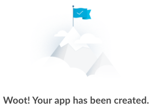
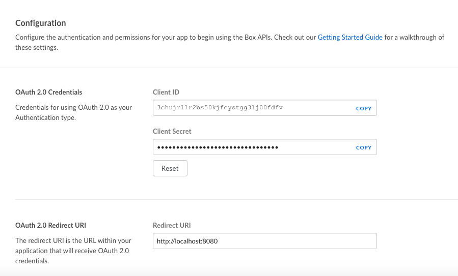
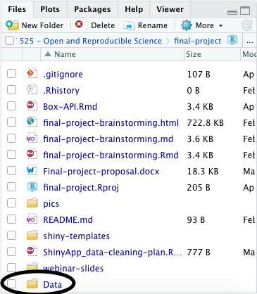

```{r setup, include=FALSE}
knitr::opts_chunk$set(
	echo = TRUE,
	message = TRUE,
	warning = TRUE
)
```


# Let's explore using the Box API to source some data!

## First, download the packages we'll need in R
```{r load packages}
if (!require(boxr)){
  install.packages("boxr")
}

if (!require("openssl")){
  install.packages("openssl")
}

```

## Next, create an app on Box.com

To do so, click [here](https://psu.app.box.com/developers/console), and follow the instructions found [here](https://psu-psychology.github.io/psy-525-reproducible-research-2020/how_to/interact-with-box.html).



## Great! Now change the OAuth Redirect URI and set up credentials in R


The URI is now set to `http://localhost:8080`. Moving on - I'm going to create variables in my local environment to house the Client ID and Client Secret for initial authorization...

Now pass these credentials into R in order to log into the app!

```{r box credentials}
# boxr::box_auth(client_id = clientID, client_secret = clientSecret)

```


## Adding authentication to my .Renviron file, so as to not inadvertently share my Box with the world.
```{r Renviron auth}
usethis::edit_r_environ()

boxr::box_auth()
```


## Let's use our newly established API to explore the current working directory

```{r contents of current wd}
library(tidyverse)

# Set box_wd to the All Files folder so the rest of the code works -- this was the default starting out
boxr::box_setwd(0)

my_box_dirs <- boxr::box_ls()
my_box_dirs %>%
  knitr::kable(.)
```


Okay, so that tells me that the current working directory is simply my Box home page, or All Files. For some reason I had thought that the working directory would be set to the location of this RMarkdown file, but this works just as well for my purposes! 

In trying to do a little digging, it doesn't seem like there is an easy way to get the folder ID for a specific Box location going down a path from the box_wd (without hard-coding the ID from the ending of the URL on Box.com). And it doesn't seem like you can set the box_wd until you know the folder ID for the location you want it to be in... so I apologize for what's coming next. 

The data that I'm trying to access lives here:
All Files/CCMH/Data Repository/Shiny-apps/outcome_prediction/Data

Let's go get it!

```{r iterative box pathing}
data_dir <- as.data.frame(my_box_dirs) %>%
  filter(name == "CCMH")
my_box_dirs <- boxr::box_ls(data_dir$id)

data_dir <- as.data.frame(my_box_dirs) %>%
  filter(name == "Data Repository")
my_box_dirs <- boxr::box_ls(data_dir$id)

data_dir <- as.data.frame(my_box_dirs) %>%
  filter(name == "Shiny-apps")
my_box_dirs <- boxr::box_ls(data_dir$id)

data_dir <- as.data.frame(my_box_dirs) %>%
  filter(name == "outcome_prediction")
my_box_dirs <- boxr::box_ls(data_dir$id)

# Set Box wd to my outcome_prediction folder within CCMH/Data Repository/Shiny-apps
boxr::box_setwd(data_dir$id)

# Update data_dir to the actual data directory within outcome_prediction
data_dir <- as.data.frame(my_box_dirs) %>%
  filter(name == "Data")

```

## Now that that's all done, let's download my data folder

```{r data download}
boxr::box_fetch(dir_id = boxr::box_getwd(), local_dir = getwd(),
  recursive = TRUE, # Will fetch subdirectories within the requested directory
  overwrite = FALSE, # Will not overwrite any files in the local directory
  delete = FALSE) # Will not delete any files in the local directory

```

It worked!


## If I wanted to save my files back to my Box folder...

Note: the example below saves my entire local working directory, but I could create a folder within this working directory for the most relevant files to save

```{r example file push}
# box_push(dir_id = boxr::box_getwd(), local_dir = getwd(),
#   ignore_dots = TRUE, # Does not push files in the local directory that start with a dot (e.g., .gitignore)
#   overwrite = FALSE, delete = FALSE)
```


# So what did I learn, and how could I use the Box API?

The potential implementation above is something that I will likely keep around for my final project. The data from our large network of counseling centers, CCMH, is kept in a shared Box drive (all data is deidentified). Our protocol is to save a separate copy of the data file we work with so as not to corrupt the original. As seen in the screencap above, I'm currently working in a directory specific to my final project for this class. This is a good example of how even copying data files to a new location can be made more reproducible (at least within my research group), because the code seen here creates a copy of the data I want to work with in my local working directory. 

While I will continue to use GitHub for version control, I think it will be nice once this project is finished to wrap up my files that create the Shiny app into a tidy folder that I can then push back to Box for more permanent storage.

Thus, I can see some utility of the Box API in my current research workflow - however, the advantages are relatively minimal over just keeping an R project in the appropriate Box folder that contains all necessary data files and scripts. 


